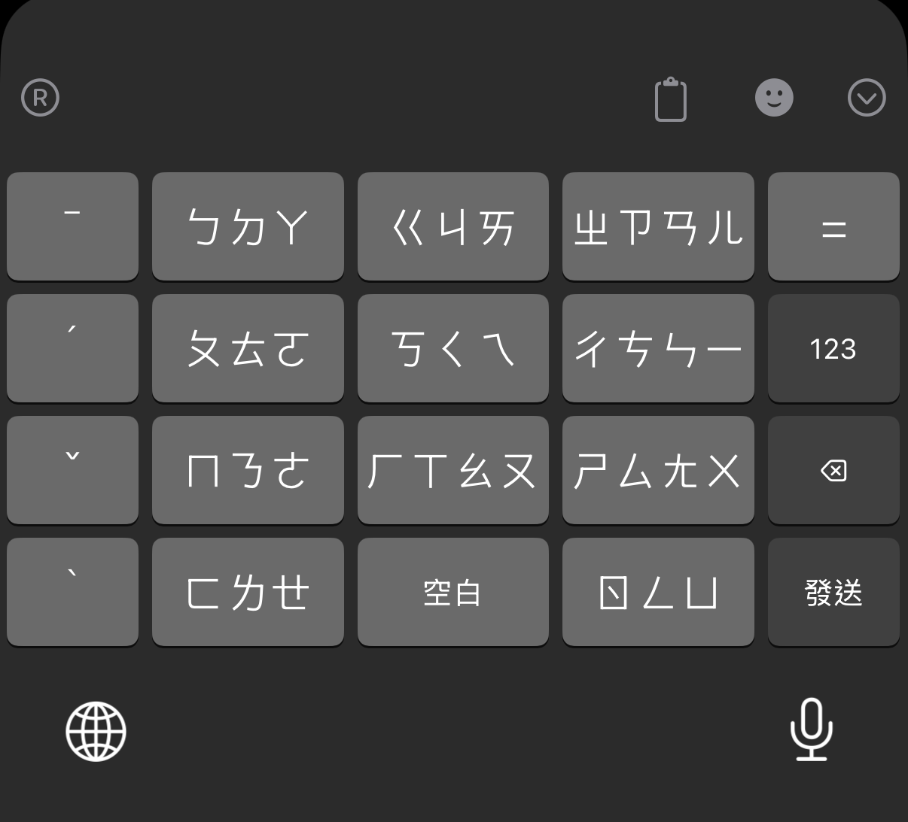
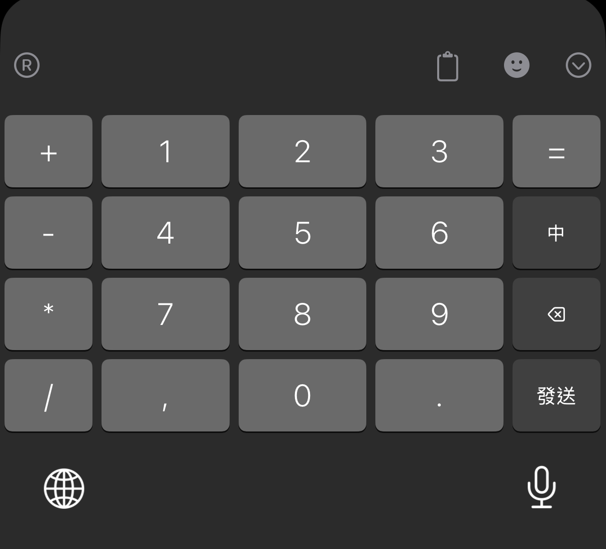

# RIME T9 注音九宮格方案

  
  
  

本項目為 RIME 輸入法引擎量身打造的 T9 (3x4) 九宮格注音輸入方案，特別針對 iOS 上的 **倉輸入法 (Hamster)** 進行了深度優化。

## 🌟 特色功能

- **九宮格佈局**：符合傳統手機使用習慣的注音九宮格排列。
- **純淨繁體字**：內建全繁體高權重字典，無須繁簡轉換器拖慢效能。
- **精確選注音**：長按即可選擇精確注音，實現「所選即所得」。
- **快捷標點號**：空白鍵長按可快速輸入 `，` `。` `？` `！`。
- **獨立聲調鍵**：獨立聲調鍵（ˉ ˊ ˇ ˋ），支援精確過濾。
- **有數字鍵盤**：可以快速切換成九宮格數字鍵盤。

## 🛠️ 安裝步驟

### 1. 準備工具
- 在 iOS 設備上安裝 [倉輸入法 (Hamster)](https://apps.apple.com/app/id6446617683)。
- 下載本倉庫的所有檔案：
  - `bopomofo_t9.schema.yaml` (RIME 方案)
  - `terra_pinyin.dict.yaml` (字典檔)
  - `t9bopomo.yaml` (鍵盤佈局檔)

### 2. 部署檔案
將本倉庫的所有檔案（`*.yaml`）放入 Hamster 的 RIME 用戶目錄中

### 3. 部署鍵盤佈局 (`t9bopomo.yaml`)
1. 將 `t9bopomo.yaml` 上傳至 Hamster 的 RIME 目錄。
2. 在 Hamster App 中進入 ***鍵盤佈局**。
3. 導入或確保佈局文件已正確啟用。

### 4. 生效設定
1. 在 Hamster App 首頁點擊 **RIME** -> **重新部署**。
2. 在 Hamster App 中進入 ***輸入方案設定** -> 選擇 **注音九宮格**。

## 🔗 相關連結
- [Hamster GitHub](https://github.com/imfuxiao/Hamster)
- [RIME 官網](https://rime.im/)
